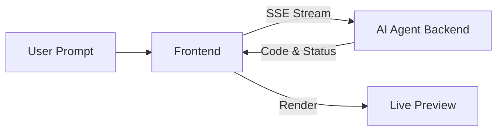

# BuildPCBs EDA Frontend

> **Text-to-Hardware. Design, Mint, and Manufacture.**

> [!CAUTION]
> **PRIVATE REPOSITORY**
> This codebase contains the proprietary "Hardware Compiler" logic and UI for BuildPCBs.
> **DO NOT PUBLISH** to public registries.

<div align="center">
  <h3>AI-Powered Electronic Design Automation Platform</h3>
  <p>Design PCBs and Enclosures with Natural Language & Code</p>
</div>

---

## 🚀 Overview

**BuildPCBs** is a next-generation EDA tool that combines the power of **AI assistance** with **code-first hardware design**. It allows engineers and makers to design electronics (PCBs) and mechanical enclosures using natural language prompts or by writing TypeScript code directly.

This frontend application interfaces with our powerful **AI Agent Backend** to generate, validate, and compile hardware designs in real-time.

---

## ✨ Key Features

- **🤖 AI Hardware Engineer:** Chat with an expert AI agent to generate circuits, add components, and route PCBs automatically.
- **⚡ Code-First Design:** Direct access to `tscircuit` (React for Electronics) and `replicad` (Code-based CAD) for precise control.
- **👁️ Live Preview:** Real-time visualization of your PCB layout, schematic, and 3D enclosure as you code or chat.
- **🔄 Real-time Streaming:** Watch the AI agent think, plan, and write code step-by-step via Server-Sent Events (SSE).
- **📦 Component Library:** Integrated search for thousands of electronic components with correct footprints.

---

## 🛠️ Tech Stack

- **Framework:** React (Vite/Next.js)
- **Electronics Engine:** [`@tscircuit/core`](https://github.com/tscircuit/tscircuit) for PCB design
- **Mechanical Engine:** [`replicad`](https://github.com/sgenoud/replicad) for 3D enclosure design
- **State Management:** Zustand / React Context
- **Styling:** Tailwind CSS + Shadcn UI
- **Visualization:** React Fiber / Three.js for 3D previews

---

## 🏗️ Architecture

### AI Agent Integration

The frontend communicates with the backend agent via a streaming connection:

1.  **User Prompt:** "Make an LED blink circuit with ATmega328"
2.  **SSE Connection:** `POST /api/agent/execute` (streams response)
3.  **Real-time Updates:**
    - `thinking`: Agent planning status
    - `tool_start` / `tool_result`: Executing actions (search, update code)
    - `code`: Valid TypeScript code for the design
    - `content`: Explanation and guidance
4.  **rendering:** The frontend takes the generated code and renders it using the `tscircuit` or `replicad` runtime.



---

## 🚦 Getting Started

### Prerequisites

- Node.js 18+
- pnpm (recommended) or npm

### Installation

1.  **Clone the repository:**

    ```bash
    git clone https://github.com/your-org/buildpcbs-eda-demo.git
    cd buildpcbs-eda-demo
    ```

2.  **Install dependencies:**

    ```bash
    pnpm install
    ```

3.  **Environment Setup:**
    Create a `.env.local` file:

    ```env
    # URL of your BuildPCBs Backend
    NEXT_PUBLIC_API_URL=http://localhost:3000

    # Privy App ID for Authentication
    NEXT_PUBLIC_PRIVY_APP_ID=your_privy_app_id
    ```

4.  **Run Development Server:**

    ```bash
    pnpm dev
    ```

5.  **Open in Browser:**
    Navigate to `http://localhost:3001` (or whatever port opens).

---

## 📂 Project Structure

```
src/
├── components/          # React components
│   ├── editor/          # Code editor (Monaco)
│   ├── preview/         # PCB/3D viewers
│   └── chat/            # AI Chat interface
├── hooks/               # Custom hooks (useAgent, useCompiler)
├── lib/                 # Utilities (API client, SSE parser)
├── stores/              # State management (project, user)
└── app/                 # Next.js pages/routes
```

---

## 🤝 Contributing

We welcome contributions! Please see our [Contributing Guide](CONTRIBUTING.md) for details.

## 📄 License

Copyright &copy; 2024 BuildPCBs.

This software is **Proprietary**. Unauthorized copying, distribution, or use of this file, via any medium, is strictly prohibited. All rights reserved.
